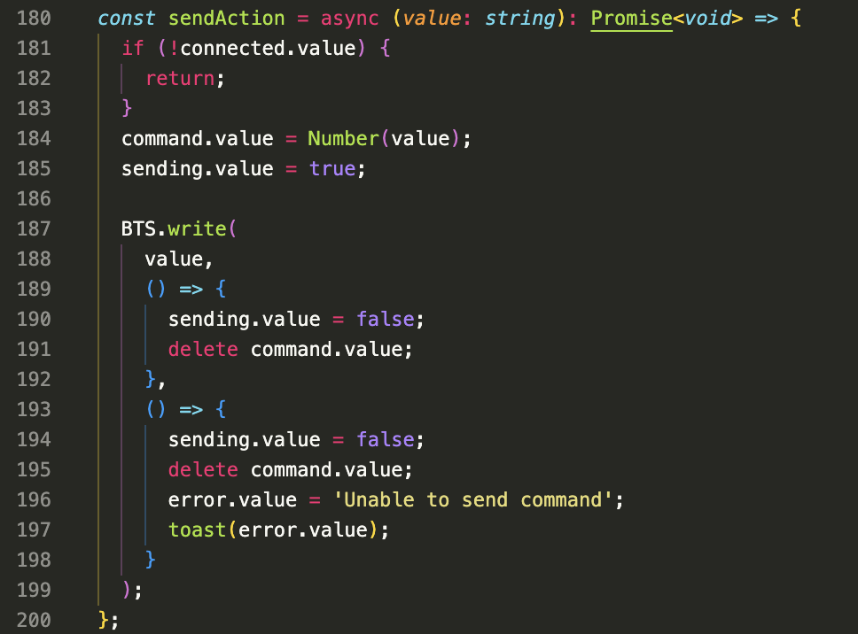

# Cocktail Remote (cocktail-remote)

An app to control the Arduino based cocktail maker using HC-05 Bluetooth module

## Platform

This app was built using Quasar Framework which utilizes CapacitorJs under the hood to enable builing native applications using just HTML, CSS and Javascript.

## How is it possible?

The app also uses the `cordova-plugin-Bluetooth-serial` Cordova plugin to enable device communication via Bluetooth legacy serial mode.

## Initialization

To initiate a connection, the app first checks if the phones Bluetooth is currently active using the simple implementation as illustrated below.

If Bluetooth is active it will attempt to connect to the last connected device if it was not disconnected before the app was closed.

Where the phone's Bluetooth is not active, the user is prompted to activate the Bluetooth, and the process is repeated again.

## Device Search and Listing

Once the app has established a connection with the phone's Bluetooth, a list of previously paired devices are presented to the user, where none of the listed devices matches the user's desired device to be connected to, the user can initiate a search by tapping on the `Scan Devices` or `Rescan Devices` button to get a fresh list of currently active devices.

## Pairing and Connection

Once a user has determined the device they want to connect to from the device list presented from the previous step, the user can now tap on specific device's name to attempt a connection, where the selected device is supprted by the serial mode specifically the Bluetooh HC-05 module, a connection will be establised and the Cocktail selection screen will be presented to the user.


## Sending Commands

Now that the user is connected to the Bluetooth device, the user can now select a prefered Cocktail.

Each Cocktail button presented to the user is mapped to a corresponding command (Numeric String) that has already been preprogrammed to be translatable by the Cocktail program running on the Arduino.

The commands interface looks something like this:

Where:

- `Name` is the name of the Cocktail.
- `Icon` is and `Icon Icons` icon used for visual representation.
- `Value` is the numeric string representation of the `Command` to send through to the Bluetooth module.
- `Class` is a string type that holds the css class name with stylings to be applied to the specific button.
- And `Bind` is an optional callback to be executed in place of and action, this is used for the `Disconnection` button.

And an example implementation would look like this:


Once a Cocktail button is tapped on, the following codeblock is executed to send the command to the Bluetooth module.

Where the BTS.write() function which is mapped to `cordova-bluetooth-serial` plugin does the work of writing the command to the bluetooth module.

### In simple terms

Each cocktail button is attached to a numeric string that corresponds with the command for the associated cocktail as defined in the Arduino sketch, when the button is pressed this string is sent as a bluetooth packet through the module which will be decoded and converted to the `unsigned long` required to process the selected cocktail. 

## Listening for Events

The app expects the Bluetooth module to return two specific string response formats which are subsequently treated as events and handled as needed.
The first is the `duration:[number]` which passes the duration for which a command will run from Arduino to the phone and the other is the `message:[string]` which will be interpreted as a notification to be shown to the user.

## Install the dependencies

```bash
yarn
# or
npm install
```

### Start the app in development mode (hot-code reloading, error reporting, etc.)

```bash
quasar dev
```

### Lint the files

```bash
yarn lint
# or
npm run lint
```

### Format the files

```bash
yarn format
# or
npm run format
```

### Build the app for production

```bash
quasar build
```

### Customize the configuration

See [Configuring quasar.config.js](https://v2.quasar.dev/quasar-cli-vite/quasar-config-js).
